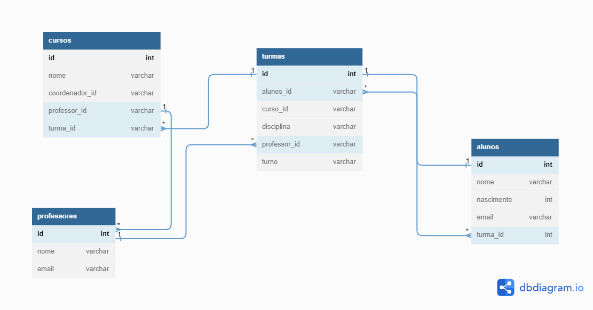

# ProjetoIndividual04

* Existem outras entidades além dessas três?
    Sim.

* Quais são os principais campos e tipos?
   ID de cada tabela que geramos as PK e suas relações.
    A tipagem dos campos das tabelas são dadas conforme o contexto.

* Como essas entidades estão relacionadas?
    As entidades estão relacionadas através de PK e FK. Nesse modelo proposto,
    as tabelas relacionam-se pelo campo ID.
